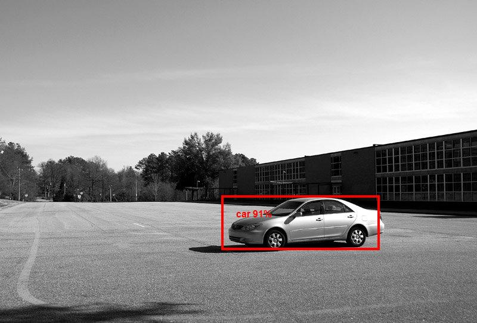

One more example of how object detection API could be exploited is that it can be used to protect vehicles against unauthorized use. The main idea is that an application could send images of a vehicle to Aspose Object Detection service with a certain interval, receive the coordinates of its boundaries on the image, and detect its movements. Once the coordinates of the object change, the application sends an alert to the owner. For example, this is how car owners could be instantly informed about their car being stolen from a parking lot.


